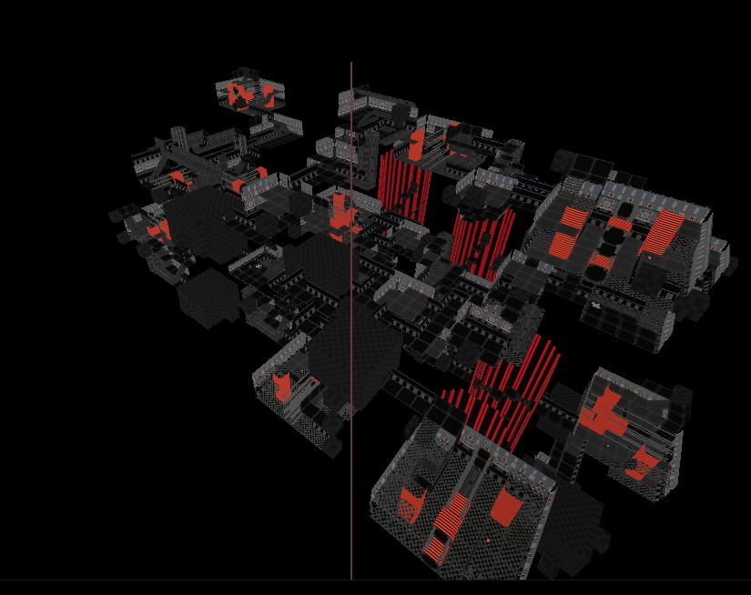
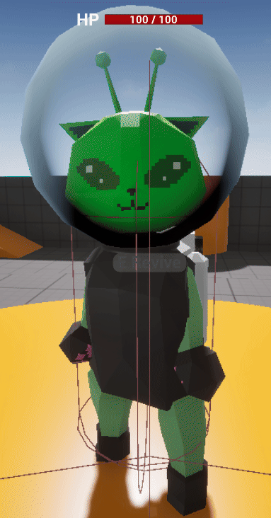
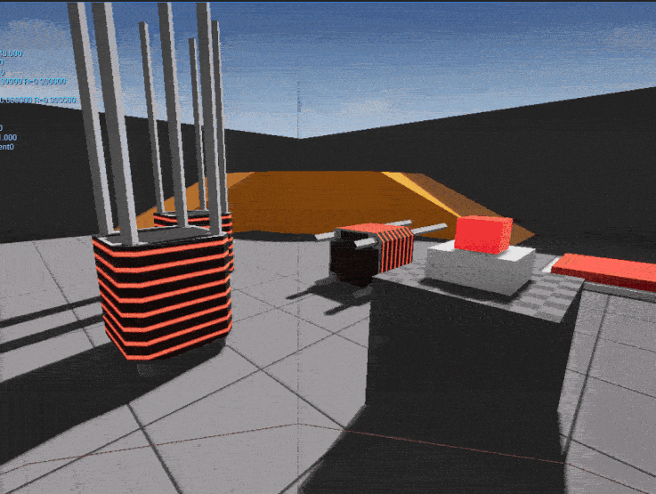

+++
title = "SpaceCats  \n(Working Title)"
date = "2026-04-15"
portfolioCover = "img/covers/glorp-game_cover.png"
portfolioIcons=["icon/unrealengine.svg", "icon/blender.svg"]
weight = 3
+++

A game my friends and I are working on, with the plan of releasing it on Steam as a full-fledged product.

The idea is a silly physics-based co-op game where you explore a procedurally generated, disaster-stricken spaceship with your friends and have to solve a few logic and physics puzzles along the way, with the goal of saving any survivors.

I've been learning a ton about multiplayer in this project, specifically Unreal Replication and Network roles. I've also been learning how to make menus with Widgets, how to make dynamic materials using Dynamic Material Instances and Custom Primitive Data, and how to make the Animation Blueprint do what I want it to do.

