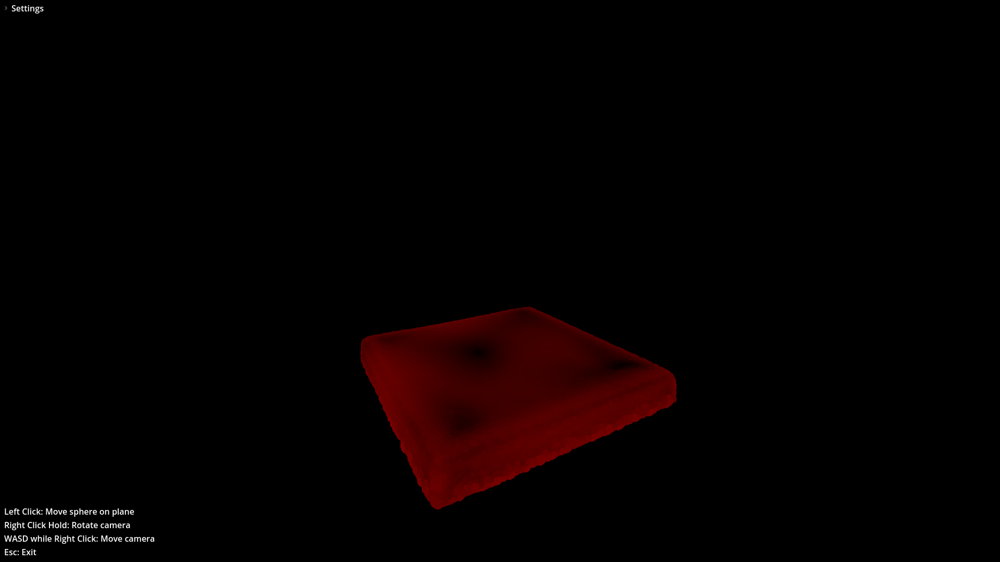
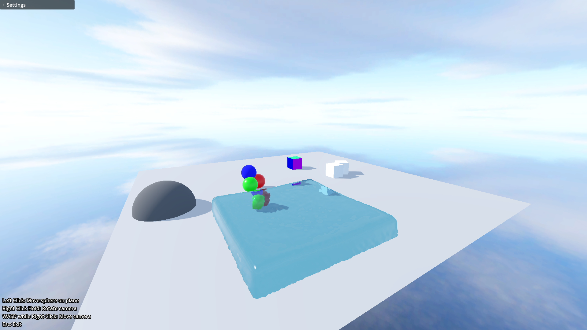
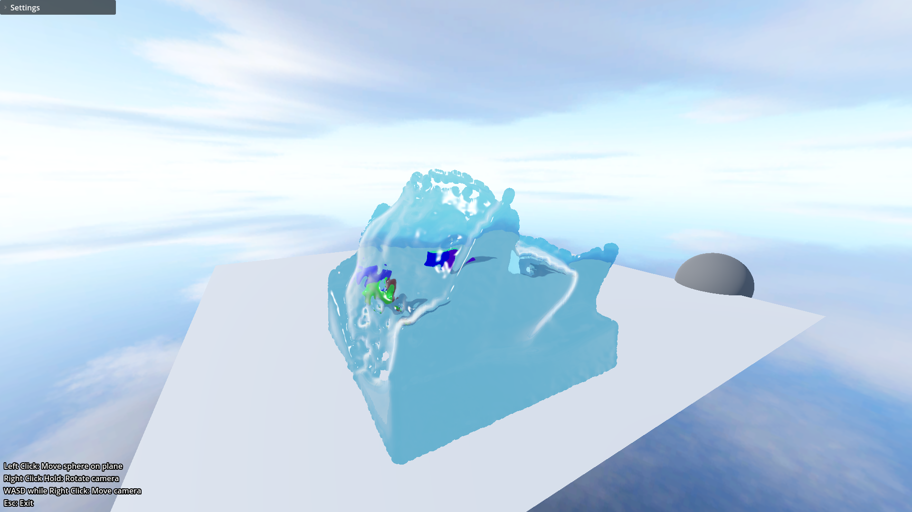

+++
title = "MLS-MPM in Godot"
date = "2026-04-15"
portfolioCover = "img/covers/mls-mpm_cover.png"
portfolioIcons=["icon/godotengine.svg"]
weight = 2
+++



For my Bachelor's thesis I implemented the  in Godot 4. This was first done just using single-threaded C# code, which I then further parallelized using C# multithreading and finally by running it all using Compute Shaders for maximum performance. This way I was able to run a 150k particle fluid sim with real-time performance. I'm sure I could've optimized it further but I had limited time for this project.

Additionally, to render the results of the simulation, I implemented  using the Godot Compositor, which let's you insert any additional logic into the rendering pipeline at various stages.

At the end, to show of that you can interact with the fluid in real-time, I added a sphere mesh and send it's position and radius to the simulation to act as a collider.

If you want to play around with it yourself, go to the  and download the executable there, it should run on any decent computer.

