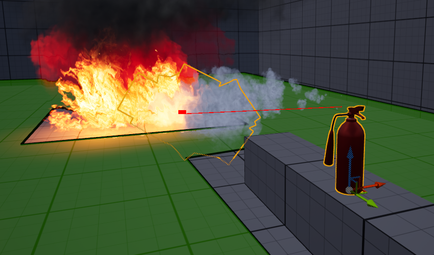
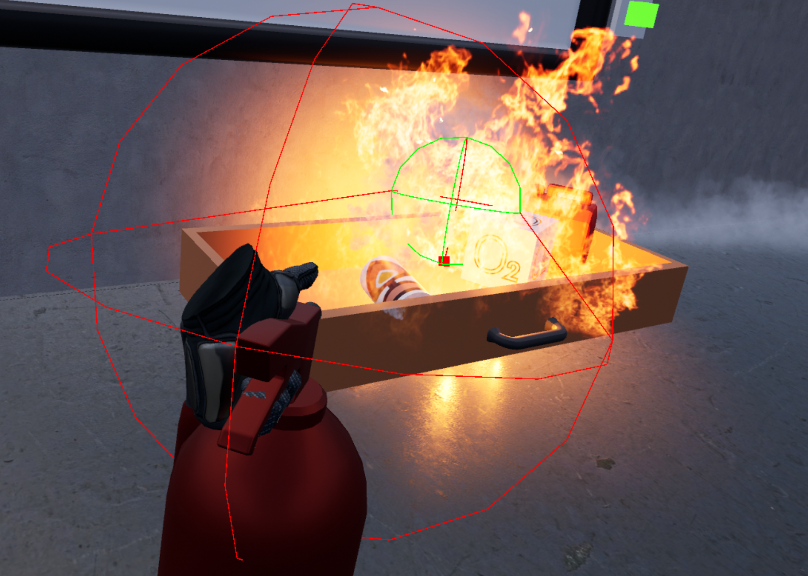
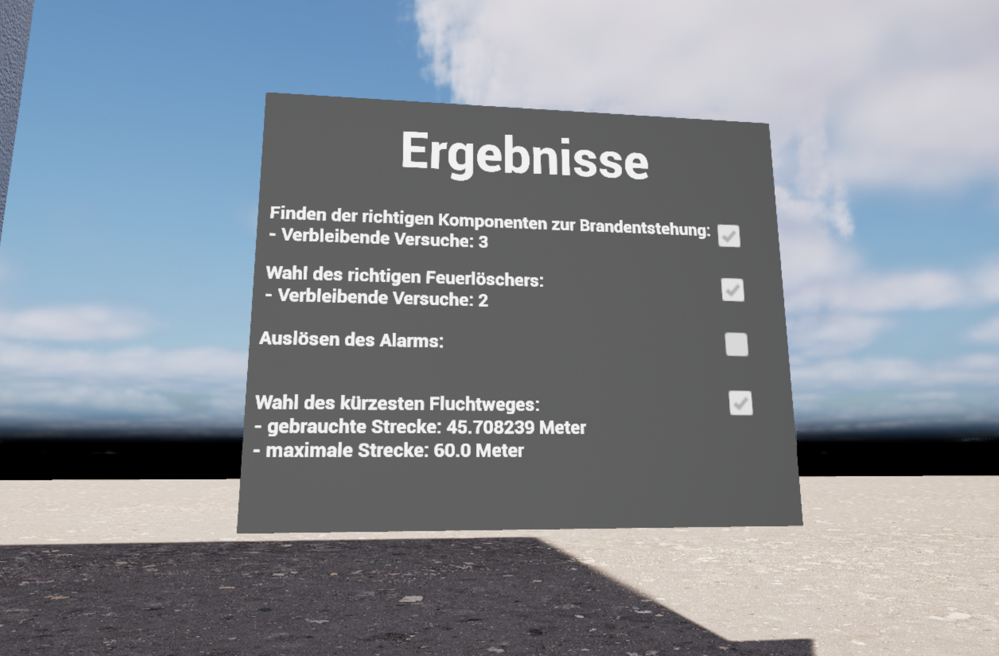
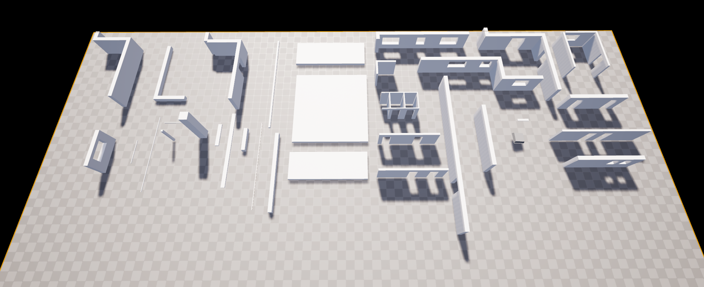
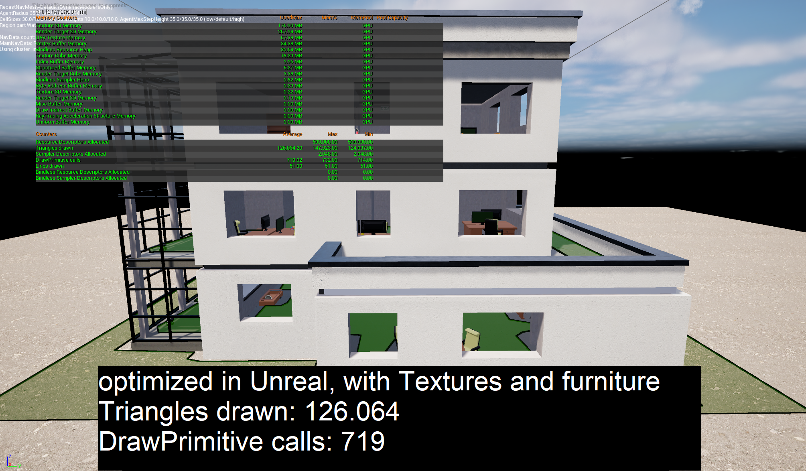

+++
title = "VR on Fire"
date = "2026-04-15"
portfolioCover = "img/covers/vr_on_fire_cropped.png"
portfolioIcons=["icon/unrealengine.svg","icon/blender.svg"]
weight = 1
+++

This was my first relatively big project done in Unreal.  

Me and two of my uni friends were tasked with creating a full-fledged VR app with the goal of making it run on our given mobile VR hardware, a Meta Quest 2.  
We got together with a graduate from the civil engineering faculty, and decided to help him bring one of his previous works to VR, a simulation of a fire in a building he designed.  
To make this project a little more interactive we decided to make the whole thing a sort of fire escape simulation with additional educational content about fire safety at the start.

The project took up the whole semester (so about 6 months).

