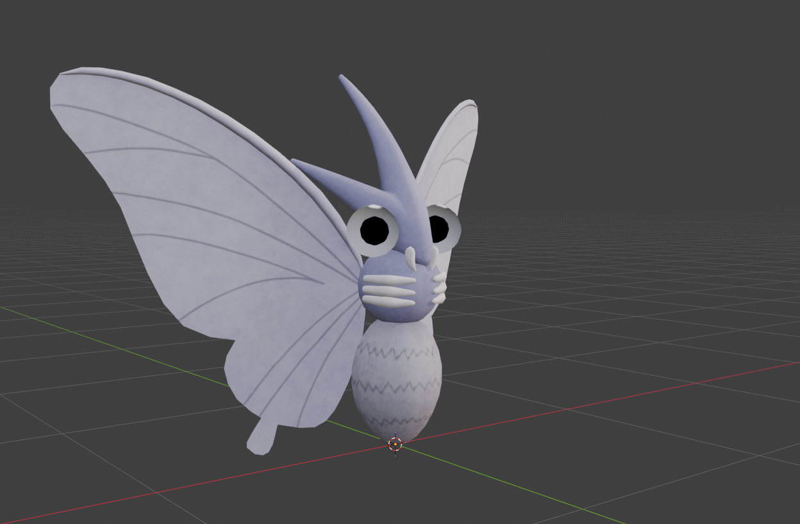

+++
title = "Paras' Eyes"
date = "2026-04-15"
portfolioCover = "img/covers/paras.png"
portfolioIcons = []
weight = 5
+++

Recently, while watching my friend play Pokemon Pokopia, I noticed that when they found a Paras in their game that their eyes seemed to behave in a weird way.
It felt like their eyes were looking towards the in-game camera, even if the creature itself was facing a different direction.

With some googling I found that there are    about this exact same thing happening in Pokemon GO.

After reading through the comments it seems like this effect also appears in real world insects.
It's called a .
Essentially the compound eyes of these insects absorb the incident light when viewed from a head-on angle, otherwise they reflect light.
The spot where the light gets absorbed is quite dark and looks to us like a pupil.

This reminded me (and some other Reddit commenters) alot of the .
It's an illusion where a concave mask of a face appears to be a normal convex face. The most well known example of this is the .
There are so many youtube videos about it.

One way to achieve this effect in 3d software would be to use a mesh for the eyes whose normals are all facing inward.
This often gets used in "inverted hull meshes" to make easy view dependent outlines for 3d objects.
If we setup a material with backface culling we will always look "inside" of the mesh and if we then put a seperate pupil mesh inside of the outside eye mesh, we should get a pupil that's always facing toward the viewer.

Now it's time to try this out for ourselves and compare.
I couldn't really find a good video of a Paras in a recent Pokemon game that shows of this eye effect, buuut I did find a , which seems to also use this inverted mesh method.
So I downloaded a Venomoth model from  (bless whoever uploaded that), and put it in Blender to try it out.
And after some material fixing (and remembering to enable backface culling for my eye material) we get a pretty similar result to the video.

Although the effect in the Pokemon GO examples does look a bit different to me.  I can't seem to be able to pinpoint an exact 3d location on the model where the pupil of the eyes would be. I think for Pokemon GO the Eye effect might have been done with a simple parallax shader for the pupils, since it looks like both pupils always have a similar offset from the eye.

Anyways I'm very proud of my Venonat and I can't wait to use this technique to make more cute eyed characters that stare into your soul in the future.

