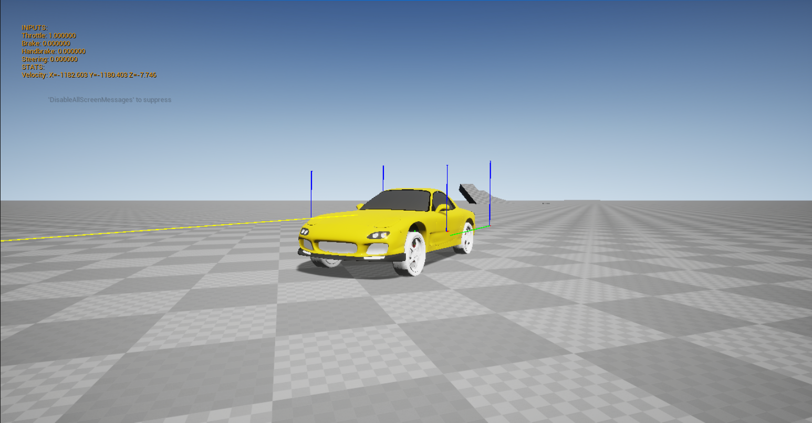
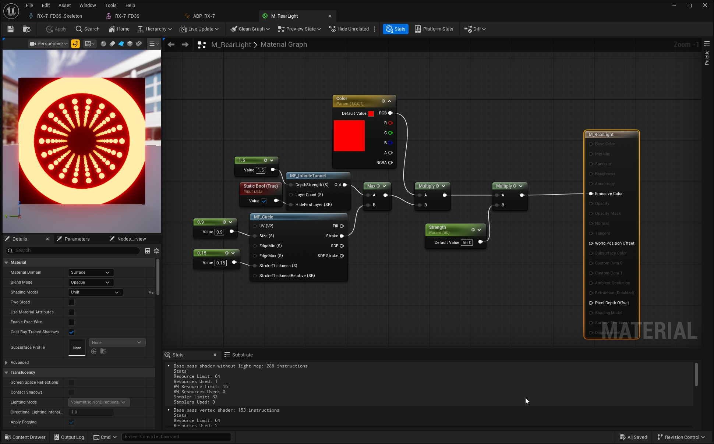
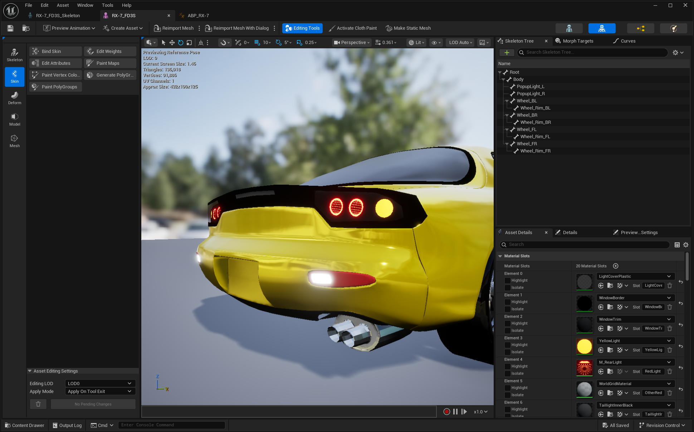

+++
title = "Physics Car"
date = "2026-04-15"
portfolioCover = "img/covers/physics-car_cover.png"
portfolioIcons=["icon/unrealengine.svg","icon/blender.svg"]
weight = 3
+++



Trying to make a semi-realistic physics-based car controller in Unreal.
I know they already have their own Chaos Vehicle Plugin, but I wanted to have something personal and get a deeper understanding of Unreal C++ code and Material Graph.

I also modeled my own car model in Blender (based on the Mazda RX-7).

Also just want to say that the shader videos by  helped me a ton.



