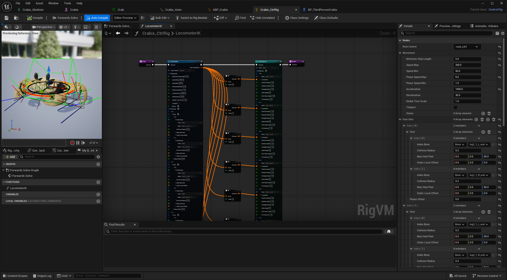

+++
title = "Procedural Animation  \nCrab"
date = "2026-04-15"
portfolioCover = "img/covers/proc-anim_cover.png"
portfolioIcons=["icon/unrealengine.svg"]
weight = 3
+++

Simple test of my abilities using Control Rig to setup a procedurally animated walking crab using Locomotor plugin. The Locomotor is quite nice to get something quickly setup and running. The setup is incredibly simple and you just have to tweek the values, but I think a self spun walking system, like explained in  would make for a much better looking result.


