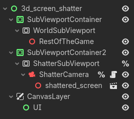
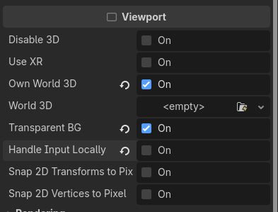
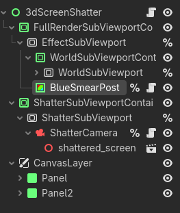

+++
title = "Screen Shatter  \nEffect"
date = "2026-04-15"
portfolioCover = "img/covers/screen-shatter_cover.png"
portfolioIcons=["icon/godotengine.svg", "icon/blender.svg"]
weight = 10
+++

Final result:



Full explanation:

I was watching CDawgVA's playthrough of Castlevania: Curse of Darkness, and saw a really cool timestop and screen shatter effect and decided I wanna replicate it in my favorite engine. Hopefully I'll learn something along the way.

First I needed more video recordings of the effect, so I found  on original hardware which shows the effect in 4:3 and  that shows the effect in an upscaled version in 16:9.  

Let's start with the screen shatter. If you go through it frame by frame you can tell that it's rendering the gameplay on shards of a quad that are placed in front of the camera and then moved away from the centre of the screen.  

So first step, the shards themselves. Interestingly, if you check the shards on the frame of the screen breaking in both videos, they seem to be different. Two possible solutions I could come up with are either generating fractures on a quad dynamically (very unlikely and kinda expensive) or have some preauthored sets of shards and maybe some mirroring or rotating of the sets of shards. I went with the second option and went into Blender to make mayself a plane of shards. I used the Cell Fracture addon to split a 1x1 plane into a bunch of shards (if you're having issues making just the right fractures with it in modern Blender,  helped + tinkering with all the settings until it looked good). All the shards are then available as seperate meshses with central origins. I will skip making multiple sets or rotating/mirroring them for now. After exporting as .glb and importing into Godot we're ready to make them fly.



Now to display the gameplay on the shards. Since we made the shards out of a quad, the individual shards should all still have UVs that, when arranged correctly, go continuously from (0,0) to (1,1), which means we can just grab a render of the current frame and place it on the shards and the UVs should sample the correct areas of the screen.



To make sure we actually render these shards after everything else in the scene we're gonna use two SubViewports, one for the shards and one for the rest of the game (you could equate this to two render passes). It is important that we order them correctly in the SceneTree (it renders top to bottom) and setup the SubViewport for the Shards to render in it's own World 3D so the shards don't show up in the main world and to render with Transparent BG so we can see through the gaps between the shards.




We can then take the texture from the WorldSubViewport, save the current frame to a new ImageTexture and hand it to the shader on the shards (if you want the shards to have live gameplay instead of a freeze frame you can just hand the texture directly to the shards and they will update every frame). Then we just make a script that moves the shards away from (0,0) on the XY plane and rotates them randomly.

For the second part, we need the blue looking time stop effect. After some analysis (watching the videos over and over), I spotted that in the high resolution version you can tell that the candelabras on the side of hallway are seen repeating away from the centre of the screen. We can compare that to the low res version where the individual candelabras are too low resolution and are blurring together into a long blue smear. But I doubt it's a shader specifically on the candelabras, everything else on screen is also kind of smearing away from the centre of the screen. Specifically the brighter parts of the screen are creating the most pronounced blue smears. So I tried to immitate that using a custom screen-space post processing shader.

To make screen-space shaders I use a ColorRect with a shader that again recieves the current render from the 3D world's SubViewport to make sure it render's after the 3D world. The shader itself is basically just a  from the centre of the screen. In the shader I also tint the output colour blue by multiplying the red and green components down a bit.
To make the effect weak in the centre and stronger towards the edges of the screen I used a gradient texture thats dark in the middle and gets brighter further away and sample it as the Alpha value for the effect. And finally to make the effect stronger for bright parts of the image we calculate the luminance times a multiplier and multiply that with the alpha value.



Now one more thing. You can tell that the game behind the shattered screen shards turns white and after the shards fly away the effect fades out. To do that I just added a whiteout progress uniform that at 1.0 turns the whole screen white and can slowly be turned back down to 0.0 to have the normal effect back. And to animate all those uniforms and the shards I just used a ton of Tweens in two seperate scripts, one on the Camera for the shards and one on the ColorRect itself.

I'm sure there's a bunch of other things you could add here to make this better looking like fake bloom and stuff but I'm happy enough with this.

Here's the full blue smear shader code if you want to use it for your own effects.
```glsl
shader_type canvas_item;
render_mode blend_mix;

uniform sampler2D world_texture : filter_linear, source_color;

uniform sampler2D alpha_tex : filter_linear; 
uniform float alpha_mult : hint_range(0.0, 1.0, 0.01) = 1.0;
uniform float smear_distance : hint_range(0.0, 1.0) = 0.1;
uniform vec3 smear_tint : source_color = vec3(0.2, 0.4, 0.8);
uniform float iterations : hint_range(0.0, 100.0, 1.0) = 20.0; //float if used in calculation, int if used only for indexing

uniform float luminance_mult : hint_range(1.0, 10.0, 0.1) = 1.5;

uniform float whiteout_progress : hint_range(0.0, 1.0, 0.01) = 0; // 1 full white to 0 normal

void fragment() {
	// calculate offset from centre of screen
	vec2 centre = vec2(0.5);
	vec2 dir = UV - centre;
	vec2 offset = dir * smear_distance;
	
	vec4 color = vec4(0.0);
	
	for (float i = 0.0; i < iterations; i++) {
		float t = i / iterations; // number of iterations doesnt increase total blur distance
		
		color += texture(world_texture, SCREEN_UV - offset * t);
	}
	color /= iterations;
	
	// get base alpha based on gradient texture
	float alpha = texture(alpha_tex, UV).r;
	// multiply by luminance to keep highlights
	float luminance = dot(color.rgb, vec3(0.299, 0.587, 0.114)); // technically not correct but good enough (https://stackoverflow.com/questions/596216/formula-to-determine-perceived-brightness-of-rgb-color)
	alpha = clamp(luminance * luminance_mult * alpha, alpha, 1.0);
	
	// make it bluey
	color.rgb *= smear_tint; 
	
	// whiteout reveals darkest areas first
	float reveal = smoothstep(whiteout_progress - 0.1, whiteout_progress, 1.0 - luminance);
	
	COLOR.rgb = mix(vec3(1.0), color.rgb, reveal);
	COLOR.a = mix(1.0, alpha * alpha_mult, reveal);
}
```
